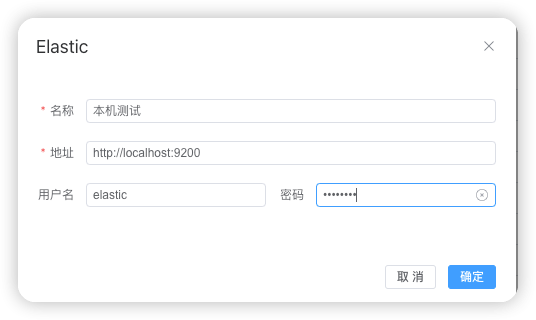
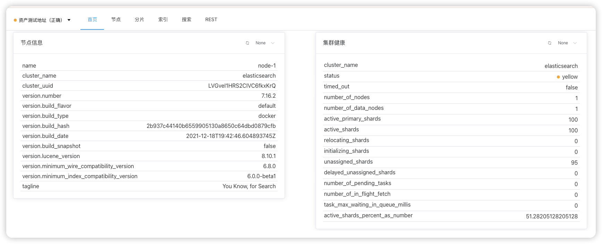
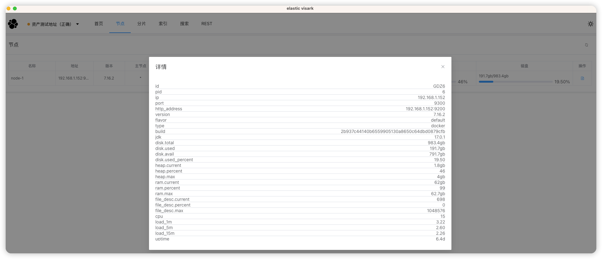
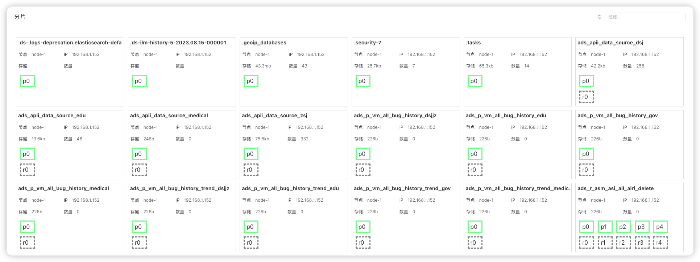
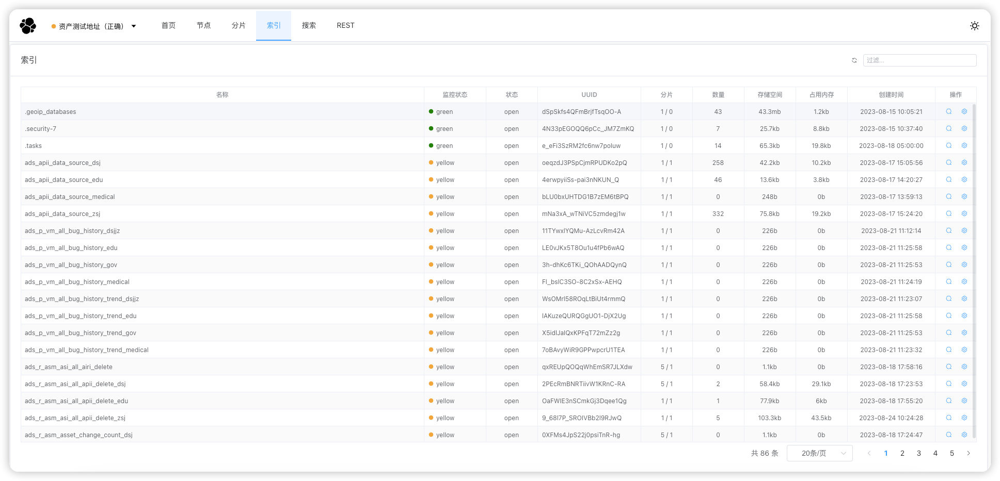
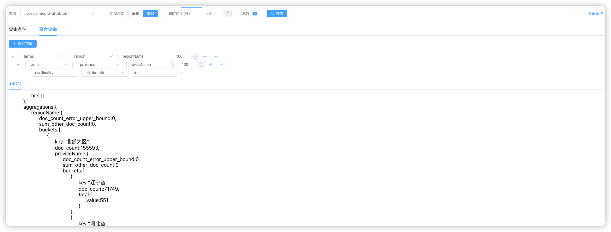
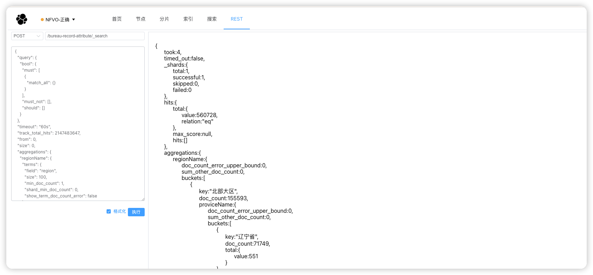

# elastic visark

1. `elastic visark`是一款基于`Vue3`,`Vite`,`electron`开发的一款`es`软件
2. `elastic visark`提供`es`的`健康`,`节点`,`分片`,`索引`,`搜索`,`REST`功能;
# 下载地址

链接: https://pan.baidu.com/s/1ztZ4qPcKrUtzfEPspnudqQ?pwd=8brx 提取码: 8brx

## 功能列表
### 集群维护

### 节点信息与健康信息

### 节点信息

### 分片

### 索引

### 搜索

#### 查询条件

#### 聚合查询

#### REST

