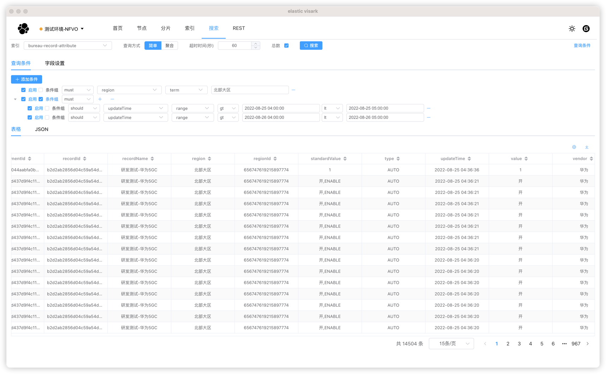

# elastic visark

1. `elastic visark`是一款基于`Vue3`,`Vite`,`electron`开发的一款`es`软件
2. `elastic visark`提供`es`的`健康`,`节点`,`分片`,`索引`,`搜索`,`REST`功能;

## 下载地址

链接: https://pan.baidu.com/s/1ztZ4qPcKrUtzfEPspnudqQ?pwd=8brx 提取码: 8brx


[使用说明](https://gitee.com/podigua/elastic-visark/wikis/)

## 界面展示


## 快速启动

```shell
pnpm install
pnpm dev
```

## 打包
```shell
# 打包当前平台
pnpm build
# 打包win平台
pnpm build-win
# 打包mac平台
pnpm build-mac
# 打包win和mac平台
pnpm build-all
```

## 贡献与支持

您可以通过下面的方法来贡献和支持该项目：

1. 在 Gitee 上为项目加注星标
2. 给予反馈
3. 提交PR
4. 贡献您的想法建议
5. 与您的朋友同事分享 elastic-visark